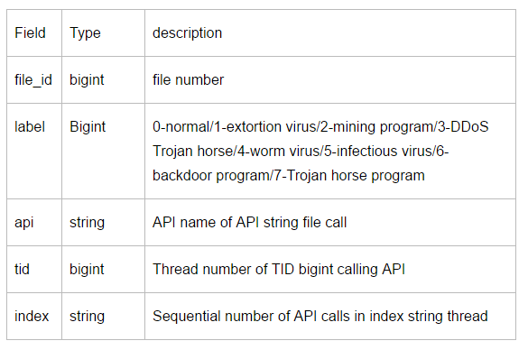
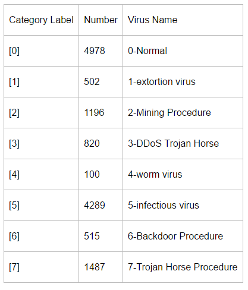
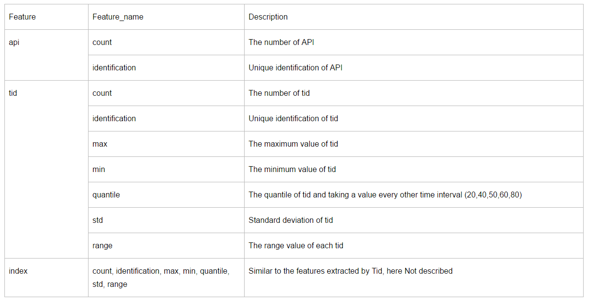
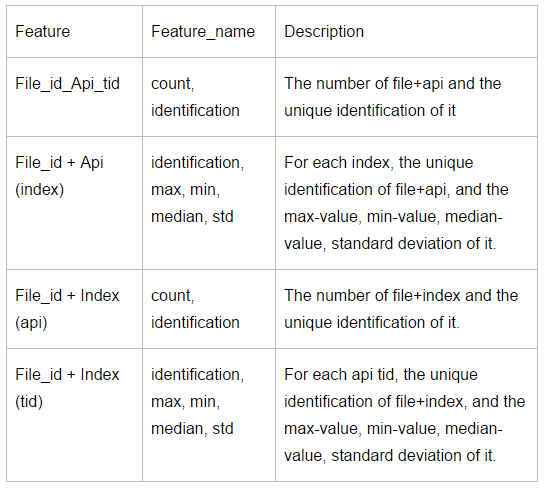
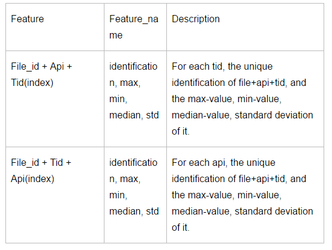
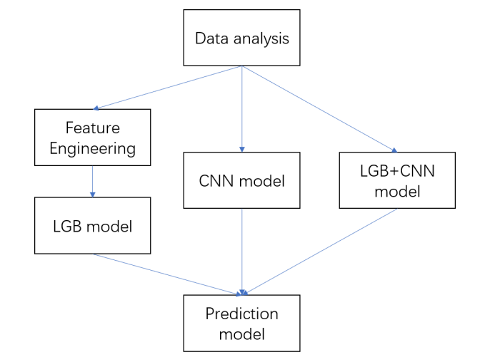
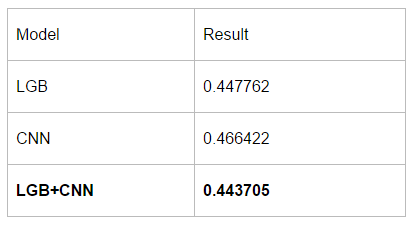

# 阿里云安全恶意程序检测

[阿里云安全恶意程序检测数据集_数据集-阿里云天池](https://tianchi.aliyun.com/dataset/137262) [天池新书代码](https://tianchi.aliyun.com/specials/promotion/bookcode?spm=a2c22.29524732.J_3941670930.14.4c883b74pESVXI) [阿里云安全恶意程序检测_学习赛_天池大赛-阿里云天池的排行榜](https://tianchi.aliyun.com/competition/entrance/231694/rankingList)

## 方案一

摘要：在安全算法竞赛中，我们将任务归结为NLP域中具有词序的文本分类问题。首先，对原始数据进行特征提取，利用自然语言处理和统计学习方法进行特征工程。特征工程的主要特点是提取三组数据，API、TID、INDEX。然后利用LGB和CNN方法构建模型。最后，利用LGB、CNN及其融合方法对测试集进行预测。实验结果表明，LGB与CNN的融合方法可以达到最佳效果，为0.443705。

### 研究框架

### 研究思路

本课程设计提供的数据来自于由沙盒程序模拟的文件（Windows可执行程序）的API指令序列。它们都是Windows二进制可执行程序，并且是不敏感的。其中，恶意文件类型有传染性病毒、木马程序、挖掘程序、ddos木马、勒索病毒等，共有6亿数据。 每个文件都有几个API调用，并且API之间可能存在一些序列关系。同时，api可以看作是一个词，文件的api调用是一个文本，所以需要解决的分类问题可以看作是一个在nlp字段中具有词序的文本分类问题。 我们认为可以从这些方面来研究我们的比赛，并提出以下方法： 

1. NLP域中的文本词汇带模型建模 
2. 统计机器学习中的传统统计特征建模与分析 
3. 深度学习领域中时间序列建模的训练模型

### 特征工程

#### 数据分析

原始数据如下所述

在建模之前，我们将探索一些原始数据的可视化，以便更快地熟悉数据，更有效地进行特性工程和建模。每个病毒类别对应的编号：

#### 特征提取

在file_id的单位中，原始数据中API、TID和索引的特征提取称为feature combination 1。feature combination 1提取的形式如下：

这种提取不够精细，因此我们提出了一种多维精细提取方法，称为feature_combination_2，它结合了file_id、api和tid数据的内在相关性。feature_combination_2的提取形式如下：

在考虑了二者结合的特点后，考虑了三者结合的特点。结合file_id、api和tid数据之间的内在关系，提出了一种多维精细度的提取方法，称为feature_combination_3。feature_combination_3的提取形式如下：

最后，结合上述特征完成特征提取工作。

###  模型

利用LGB和CNN方法构建模型。然后用LGB、CNN及其融合方法对测试集进行预测。

###  结果分析

对于LGB和CNN模型，预测了测试集。然后将这两种方法融合在一起，对测试集进行预测。

最终结果如下表所示。可以看出，LGB模型和CNN模型的预测结果是良好的，两者结合可以得到最佳的预测结果。

## 方案二

包含了两个主要的Python脚本，它们分别用于特征提取和模型预测：

1. get_feature.py
2. run.py 

### get_feature 特征提取脚本

目的： 提取文本特征并训练一个基于TF-IDF和逻辑回归的模型。主要步骤：

1. 配置路径：`FEATURE_PATH` 和 `DATA_PATH` 用于指定特征和数据文件的存储路径。
2. TF-IDF 向量化：使用 `TfidfVectorizer` 从文本数据中提取TF-IDF特征。
3. 数据加载：`loadData` 函数用于加载训练和测试数据集。
4. TF-IDF 模型训练：`tfidfModelTrain` 函数对训练和测试数据集应用TF-IDF向量化，并返回转换后的特征。
5. NB-LR 模型训练：`nblrTrain` 函数使用分层K折交叉验证来训练一个基于TF-IDF特征的逻辑回归模型，并返回训练集和测试集的预测概率。
6. 特征构建：`makeFeature` 和 `makeFeature_v2` 函数用于构建基于文件ID和API调用的特征，包括文件计数、线程计数、API计数等。
7. 主执行流程：在 `if __name__ == '__main__':` 块中，脚本加载数据，构建特征，并训练TF-IDF和逻辑回归模型，最后保存特征和预测结果。

### run 模型预测脚本

目的：使用XGBoost模型进行多类别预测。主要步骤：

1. 配置路径和参数：设置特征路径、结果路径和XGBoost模型参数。
2. XGBoost 训练：`xgb_train` 函数使用XGBoost训练模型，并返回模型、验证集预测和测试集预测。
3. 数据准备：加载特征文件，合并不同版本的特征，并准备训练和测试数据。
4. 模型训练和预测：使用 `StratifiedKFold` 进行分层K折交叉验证，并在每个折中训练XGBoost模型，记录验证集的对数损失，并预测测试集。
5. 结果合并和提交：合并所有折的预测结果，并生成提交文件。

## 方案三

见书中内容

# O2O优惠券使用预测 

数据集介绍

 [O2O优惠券使用预测数据集_数据集-阿里云天池](https://tianchi.aliyun.com/dataset/137322?spm=5176.21213303.J_qCOwPWspKEuWcmp8qiZNQ.8.6a3e2f3dlgUQAx&scm=20140722.S_community@@%E5%A4%A7%E8%B5%9B%E6%95%B0%E6%8D%AE%E9%9B%86@@137322._.ID_community@@%E5%A4%A7%E8%B5%9B%E6%95%B0%E6%8D%AE%E9%9B%86@@137322-RL_o2o%E4%BC%98%E6%83%A0%E5%88%B8%E4%BD%BF%E7%94%A8%E9%A2%84%E6%B5%8B-LOC_llm-OR_ser-V_4-RE_new6-P0_2-P1_0)  

[GitHub - FNo0/o2o_dataset: o2o数据集](https://github.com/FNo0/o2o_dataset/tree/master)

## 训练集
用户线下消费和优惠券领取行为表（offline_train.csv.zip）

| Field | Description |
| --- | --- |
| User_id | 用户ID |
| Merchant_id | 商户ID |
| Coupon_id | 优惠券ID：null表示无优惠券消费，此时Discount_rate和Date_received字段无意义 |
| Discount_rate | 优惠率： + $ x \in [0,1] $代表折扣率； + $ x:y $表示满x减y。单位是元 |
| Distance | + user经常活动的地点离该merchant的最近门店距离是$ x*500 $米（如果是连锁店，则取最近的一家门店），$ x\in[0,10] $ ； + null表示无此信息，0表示低于500米，10表示大于5公里； |
| Date_received | 领取优惠券日期 |
| Date | 消费日期： + 如果Date=null & Coupon_id != null，该记录表示领取优惠券但没有使用，即负样本； + 如果Date!=null & Coupon_id = null，则表示普通消费日期； + 如果Date!=null & Coupon_id != null，则表示用优惠券消费日期，即正样本； |

用户线上点击/消费和优惠券领取行为表（online_train.csv.zip）

| Field | Description |
| :--- | :--- |
| User_id | 用户ID |
| Merchant_id | 商户ID |
| Action | 0 点击， 1购买，2领取优惠券 |
| Coupon_id | 优惠券ID： + null表示无优惠券消费，此时Discount_rate和Date_received字段无意义。 + “fixed”表示该交易是限时低价活动。 |
| Discount_rate | 优惠率： + $ x \in [0,1] $代表折扣率； + $ x:y $表示满x减y； + “fixed”表示低价限时优惠； |
| Date_received | 领取优惠券日期 |
| Date | 消费日期： + 如果Date=null & Coupon_id != null，该记录表示领取优惠券但没有使用，即负样本； + 如果Date!=null & Coupon_id = null，则表示普通消费日期； + 如果Date!=null & Coupon_id != null，则表示用优惠券消费日期，即正样本； |

## 测试集
用户线下优惠券使用预测样本(offline_test.csv.zip)

| Field | Description |
| --- | --- |
| User_id | 用户ID |
| Merchant_id | 商户ID |
| Coupon_id | 优惠券ID |
| Discount_rate | 优惠率： + $ x \in [0,1] $代表折扣率； + $ x:y $表示满x减y |
| Distance | + user经常活动的地点离该merchant的最近门店距离是x*500米（如果是连锁店，则取最近的一家门店），$ x\in[0,10] $； + null表示无此信息，0表示低于500米，10表示大于5公里； |
| Date_received | 领取优惠券日期 |

## 提交集
研究人员需要为上述预测表预测出15天内用户 线下 使用优惠券的概率，其中user_id,coupon_id和date_received均来自上述预测样本, 而Probability为预测值。

| Field | Description |
| --- | --- |
| Coupon_id | 优惠券ID |
| Date_received | 领取优惠券日期 |
| Probability | 15天内用券概率，需预测给出 |

# 工业蒸汽量预测

[官网地址](https://tianchi.aliyun.com/competition/entrance/231693/introduction?spm=5176.21213303.J_qCOwPWspKEuWcmp8qiZNQ.13.2d8c2f3dt1jokI&scm=20140722.S_community@@%E5%A4%A7%E8%B5%9B@@231693._.ID_community@@%E5%A4%A7%E8%B5%9B@@231693-RL_%E5%B7%A5%E4%B8%9A%E8%92%B8%E6%B1%BD%E9%A2%84%E6%B5%8B-LOC_llm-OR_ser-PAR1_213e368017389178662073930e7ec9-V_4-RE_new6-P0_8-P1_0)

## 赛题背景

火力发电的基本原理是：燃料在燃烧时加热水生成蒸汽，蒸汽压力推动汽轮机旋转，然后汽轮机带动发电机旋转，产生电能。在这一系列的能量转化中，影响发电效率的核心是锅炉的燃烧效率，即燃料燃烧加热水产生高温高压蒸汽。==锅炉的燃烧效率的影响因素很多，包括锅炉的可调参数，如燃烧给量，一二次风，引风，返料风，给水水量；以及锅炉的工况，比如锅炉床温、床压，炉膛温度、压力，过热器的温度==等。

## 赛题描述

经脱敏后的锅炉传感器采集的数据（采集频率是分钟级别），根据锅炉的工况，预测产生的蒸汽量。

## 数据说明

数据分成训练数据（train.txt）和测试数据（test.txt），其中字段”V0”-“V37”，这38个字段是作为特征变量，”target”作为目标变量。选手利用训练数据训练出模型，预测测试数据的目标变量，排名结果依据预测结果的MSE（mean square error）。

结果提交: 选手需要提交测试数据的预测结果（txt格式，只有1列预测结果）。

结果评估:预测结果以mean square error作为评判标准。

# 天猫用户重复购买预测

https://tianchi.aliyun.com/competition/entrance/231576/information

